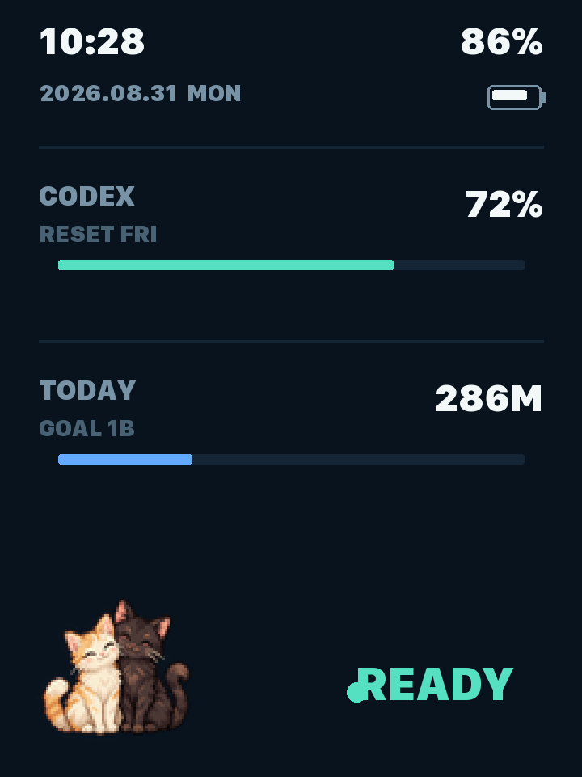
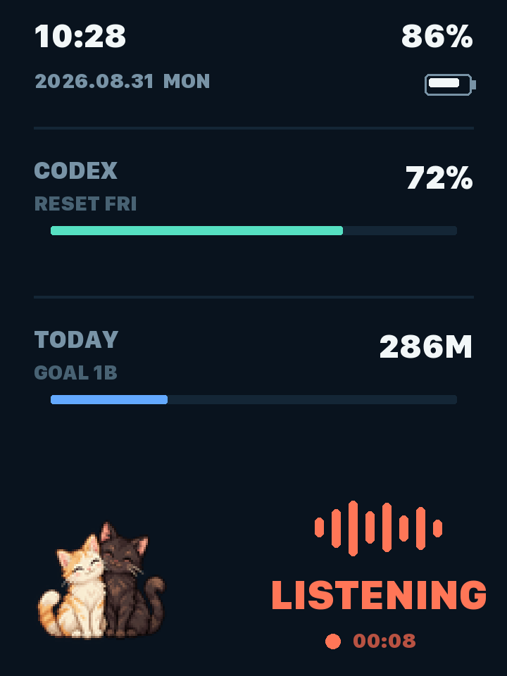

<p align="right">
  <strong>English</strong> · <a href="README.zh_CN.md">简体中文</a>
</p>

# AI Passport Mac Voice Remote

This fork turns FoloToy AI Passport into a wireless macOS voice-input remote:

- hold a physical button to trigger dictation and stream the board microphone;
- send Return or Command-Delete from the other buttons;
- show date/time, battery, connection state, optional AI usage metrics, and an optional pet;
- run the keyboard and 8 kHz mono microphone over one encrypted BLE HID pairing.

The repository contains both sides required to use it: ESP32-C3 firmware and a
native macOS menu-bar App with its Bridge built in. The metric source and on-screen pet are optional,
replaceable plugins; a public clone does not require Codex or private artwork.
It preserves the original [FoloToy AI Passport](https://github.com/FoloToy/ai-passport)
history and MIT attribution while maintaining this product independently.

## Interface states

<table>
  <tr>
    <td align="center"></td>
    <td align="center"></td>
  </tr>
  <tr>
    <td align="center"><strong>Connected / Ready</strong></td>
    <td align="center"><strong>Listening</strong></td>
  </tr>
</table>

The usage metrics and pet shown here are optional plugin examples; the public
default build works without either one.

## Install the firmware

Download `FoloToy-AI-Passport-full.bin` from a GitHub Release. On a
factory-provisioned AI Passport, use the permanent Recovery and the official
mini-program installer: hold UP while powering on for five seconds, then install
the release artifact. Recovery parses the merged image while protecting the
per-device `cardid` and permanent Recovery partitions.

Developers may instead use segmented `idf.py flash`. Do not use a browser or
`esptool` to raw-write the merged image at `0x0` as a normal update: its padding
overwrites runtime NVS and resets the Bluetooth bond. The raw path is only for a
deliberate USB recovery when the artifact has been verified to end before
`cardid` and the user is prepared to pair again. See [firmware installation and
recovery safety](docs/development/ble-recovery-compatibility.md).

## Quick start on macOS

For normal use, download `AI-Passport-macOS.zip` from a Release, move
`AI Passport.app` into Applications, and open it. The App is a universal native
binary and does not bundle or require Python. Install BlackHole 2ch once, then
pair an AI Passport already running compatible firmware.

To build the same App from a clone (Xcode Command Line Tools required):

```bash
git clone https://github.com/ihonghong/ai-passport-macos-voice-remote.git
cd ai-passport-macos-voice-remote
./host/macos/install.sh --dry-run
./host/macos/install.sh --yes
./host/macos/doctor.sh
```

The installer builds one native App and adds the Mac host only. It does **not** flash the board, erase its
identity data, or reset Bluetooth pairing. If BlackHole is newly installed, restart
macOS and rerun the installer. Then pair `AI Passport` in System Settings > Bluetooth.

**Manual shortcut setup is required.** The host configuration binds the physical
`up`, `down`, and `ok` buttons directly. By default, holding Down sends **Left
Control + Left Command** while it streams audio. This is an AI Passport project
default, not a universal macOS, Dictation, or input-method default. Each user
must configure their preferred voice-input application or input method to use
the same combination as its global voice trigger. The installer does not
configure Doubao, macOS Dictation, or any other input method.

Existing host configuration is preserved. Edit
`~/Library/Application Support/AI Passport Bridge/config.json` to select the audio
device or metric Provider. Metrics are disabled by default. The optional Codex
Provider reads rate limits from the local Codex CLI and token-count events from
local `~/.codex` session records; it does not upload those records.

For firmware builds, button mappings, permissions, troubleshooting, uninstalling,
and safe flashing, read the [complete macOS guide](host/macos/README.md). The
[product and firmware overview](docs/README.md) documents the hardware contract and
repository layout.

## Optional plugins

- Metric Providers: the native App supports `codex`, `auto`, and the private-data-free
  `none` default; the legacy Python adapter remains as a plugin reference.
- [Pet plugins](main/plugins/pets/README.md): build with no pet, a redistributable
  custom pet, or owner-local pet assets when present.

## Agent installation

Give a coding agent this repository and the following request:

```text
Read AGENTS.md and host/macos/README.md. Preserve existing changes and running
services. Run ./host/macos/install.sh --dry-run first, then install the macOS host
and run ./host/macos/doctor.sh. Tell me to bind my dictation or input-method voice
shortcut to Left Control + Left Command; do not configure an input method without
my approval. Do not erase Flash, reset pairing, or flash firmware unless I
explicitly ask. Report host checks and device checks separately.
```

AI contributors must start with [AGENTS.md](AGENTS.md). Human contributors can use
[CONTRIBUTING.md](.github/CONTRIBUTING.md). The project is licensed under
[LICENSE](LICENSE); optional artwork must carry its own redistribution permission.
